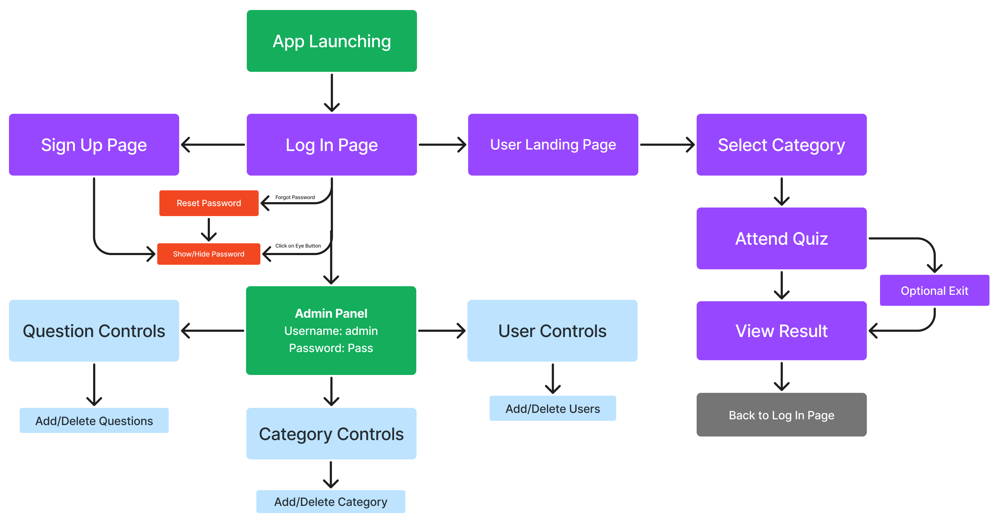
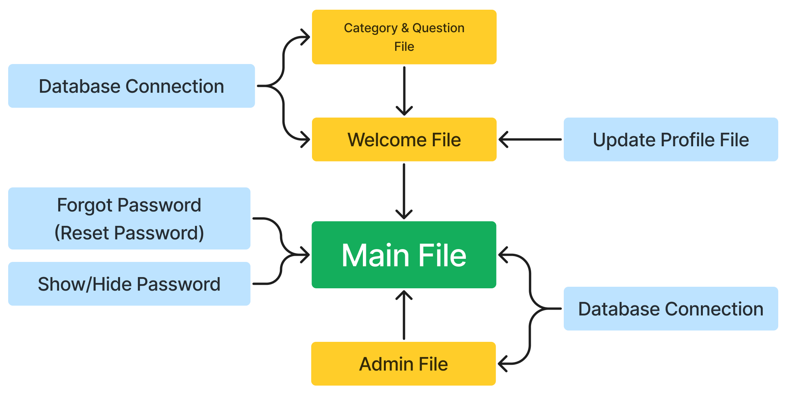

# S5 DBMS Project
The Project is a **Quiz Application**, frontend & backend coded in Python Tkinter & MySQL respectively. 

### Quick Navigation

* Click the link to go to specific heading

  * [Get Started](#Get-Started)

  * [Run the app](#Run-the-app)

  * [Page Flow of the app](#Page-Flow-of-the-app)

  * [Code Structure and Imports](#Code-Strucutre-and-Imports)

 
 
 

  

  * [Demo Queries](#Demo-Queries)

  * [Write some real queries](#Write-some-real-queries)

  * [Dropping user](#Dropping-user)

 

<!-- ------------------------------------------- -->

---

## Get started

* Install Python & MySQL on your system

* Clone the repository to your local machine 

* Install necessary python packages

        pip install -r requirements.txt

    * if the above code shows error, then you can manually required packages from [requirements.txt](https://github.com/004Ajay/DBMS-Project/blob/main/requirements.txt)         

 

<!-- ------------------------------------------- -->

---

## Run the app

* Start MySQL Workbench & add new connection with details:

* Now, select all MySQL Queries from [database.sql](https://github.com/004Ajay/DBMS-Project/blob/main/database.sql) file & paste it in your MySQL Workbench

* And, run the [main.py](https://github.com/004Ajay/DBMS-Project/blob/main/main.py) file to see the magic

* You can create a new user for login or use the existing user from [database.sql](https://github.com/004Ajay/DBMS-Project/blob/main/database.sql)

 

<!-- ------------------------------------------- -->

---

## Page Flow of the app

 

<!-- ------------------------------------------- -->

---

## Code Structure and Imports

 

* There are more things in the app that are useful, please explore yourself. 
<!-- ------------------------------------------- -->